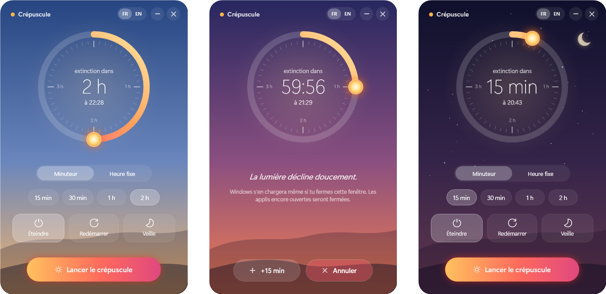
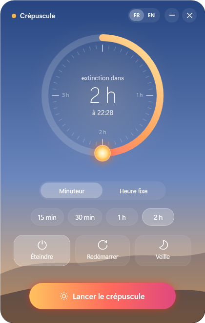
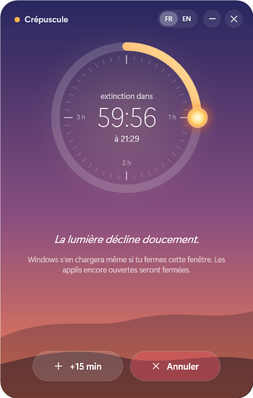
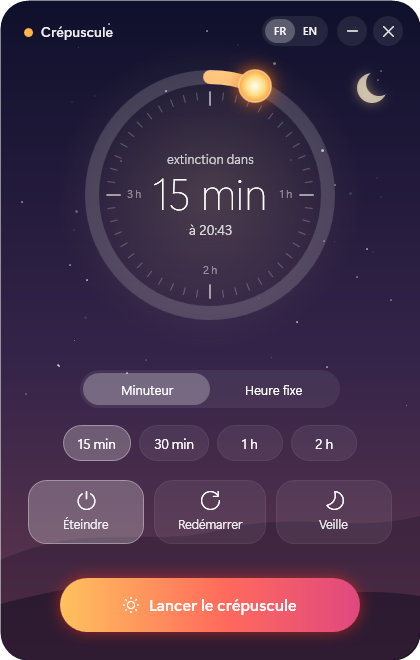

<div align="center">


# Crépuscule

Un programmateur d'extinction pour Windows, en forme de coucher de soleil.

[](https://github.com/GreenGKH/crepuscule/releases/latest)
[](LICENSE)

[English](README.md) · **Français**

<br>



</div>

<br>

## Le soleil sert de minuteur



Le délai se règle en faisant glisser le soleil sur l'anneau : jusqu'à quatre heures, par pas de cinq minutes, ou à la minute près avec la molette. Une heure précise peut aussi être choisie à la place.

À l'approche de l'échéance, le ciel passe du bleu doré au violet profond, et les premières étoiles apparaissent dans le dernier quart d'heure.

Trois actions au choix : extinction, redémarrage ou veille.

<br clear="right">

## Un compte à rebours discret



Le cadran décompte en temps réel, avec **+15 min** et **Annuler** toujours à portée de clic.

Cinq minutes avant l'échéance, la fenêtre revient au premier plan pour rappeler d'enregistrer le travail en cours.

Le reste du temps, l'application se range dans la zone de notification, près de l'horloge.

<br clear="left">

## Rien à installer



Un seul exécutable d'environ 350 Ko, qui s'appuie sur le .NET Framework déjà présent dans Windows 10 et 11.

L'extinction et le redémarrage sont confiés à Windows lui-même : ils ont lieu même une fois l'application fermée.

L'interface est disponible en français et en anglais, au choix depuis la barre de titre.

**[Télécharger la dernière version →](https://github.com/GreenGKH/crepuscule/releases/latest/download/Crepuscule.exe)**

<br clear="right">

---

<details>
<summary><b>Installation</b></summary>

1. Télécharger `Crepuscule.exe` depuis la [dernière version](https://github.com/GreenGKH/crepuscule/releases/latest).
2. Le lancer. Aucune installation n'est nécessaire.

L'exécutable n'est pas signé numériquement : Windows SmartScreen peut afficher *« Windows a protégé votre ordinateur »*. Un clic sur **Informations complémentaires**, puis sur **Exécuter quand même**, lance l'application. Le code source complet se trouve dans [`Crepuscule.cs`](Crepuscule.cs).

</details>

<details>
<summary><b>Raccourcis clavier</b></summary>

| Touche | Action |
|---|---|
| <kbd>Entrée</kbd> | Lancer le compte à rebours |
| <kbd>↑</kbd> / <kbd>↓</kbd> | ±5 minutes |
| Molette sur le cadran | ±1 minute |
| <kbd>Échap</kbd> | Ranger dans la zone de notification |

</details>

<details>
<summary><b>FAQ</b></summary>

**L'extinction a-t-elle lieu si l'application est fermée ?**
Pour l'extinction et le redémarrage, oui : la programmation est enregistrée auprès de Windows (`shutdown /s /t …`). Rouvrir l'application fait réapparaître le compte à rebours. La veille, elle, est déclenchée par l'application : celle-ci doit rester ouverte ou rangée dans la zone de notification.

**Comment annuler une extinction sans l'application ?**
Par un clic droit sur l'icône près de l'horloge, puis *Annuler la programmation*, ou avec la commande `shutdown /a` dans un terminal.

**Les applications ouvertes sont-elles fermées ?**
Oui. À l'échéance, Windows les ferme sans proposer d'enregistrer : c'est le rôle de l'alerte des cinq minutes.

**L'application enregistre-t-elle des données ?**
Seulement deux petits fichiers texte dans `%APPDATA%\Crepuscule` : les derniers réglages et la programmation en cours. Rien n'est envoyé sur Internet.

</details>

<details>
<summary><b>Compiler depuis les sources</b></summary>

Le compilateur C# fourni avec Windows suffit : Visual Studio n'est pas nécessaire.

```powershell
git clone https://github.com/GreenGKH/crepuscule.git
cd crepuscule
powershell -ExecutionPolicy Bypass -File build.ps1
```

Le script dessine l'icône, puis produit `Crepuscule.exe`. Toute l'application (C# 5 et WPF, interface construite en code) tient dans [`Crepuscule.cs`](Crepuscule.cs).

Pousser un tag `v*` compile l'exécutable sur GitHub Actions et l'attache à une nouvelle version.

</details>

<details>
<summary><b>Contribuer</b></summary>

Les idées et les rapports de bug sont les bienvenus dans les [issues](https://github.com/GreenGKH/crepuscule/issues). Les modifications de code passent par une pull request.

</details>

<br>

<sub>Distribué sous [licence MIT](LICENSE).</sub>
