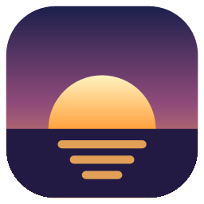
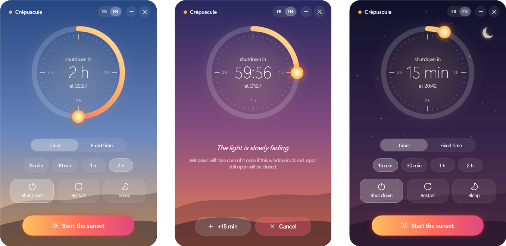
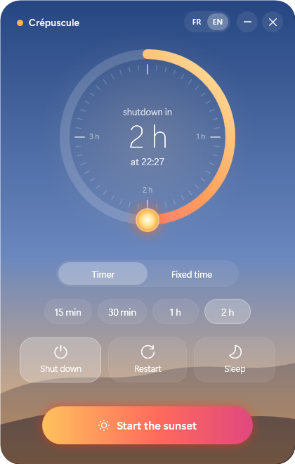
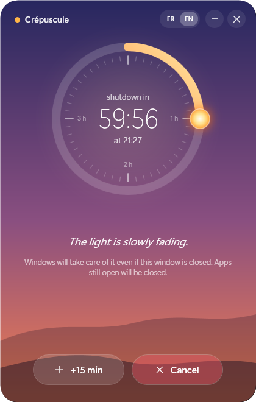
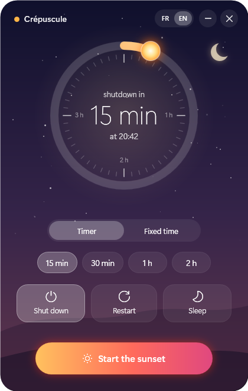

<div align="center">



# Crépuscule

A shutdown timer for Windows, shaped like a sunset.

[](https://github.com/GreenGKH/crepuscule/releases/latest)
[](LICENSE)

**English** · [Français](README.fr.md)

<br>



</div>

<br>

## The sun is the timer



The delay is set by dragging the sun around the ring: up to four hours, in five-minute steps, or minute by minute with the mouse wheel. A fixed time can be picked instead.

As the deadline approaches, the sky drifts from golden blue to deep violet, and the first stars appear during the last quarter of an hour.

Three actions are available: shutdown, restart and sleep.

<br clear="right">

## A countdown that stays out of the way



The dial counts down in real time, with **+15 min** and **Cancel** always one click away.

Five minutes before the deadline, the window comes back to the foreground as a reminder to save open work.

The rest of the time, the app sits in the notification area, next to the clock.

<br clear="left">

## Nothing to install



A single executable of about 350 KB, built on the .NET Framework already present in Windows 10 and 11.

Shutdown and restart are handed over to Windows itself, so they happen even once the app is closed.

The interface is available in English and French, switchable from the title bar.

**[Download the latest release →](https://github.com/GreenGKH/crepuscule/releases/latest/download/Crepuscule.exe)**

<br clear="right">

---

<details>
<summary><b>Installation</b></summary>

1. Download `Crepuscule.exe` from the [latest release](https://github.com/GreenGKH/crepuscule/releases/latest).
2. Run it. No setup is needed.

The executable is not code-signed, so Windows SmartScreen may show *"Windows protected your PC"*. Selecting **More info** then **Run anyway** starts the app. The full source code is in [`Crepuscule.cs`](Crepuscule.cs).

</details>

<details>
<summary><b>Keyboard shortcuts</b></summary>

| Key | Action |
|---|---|
| <kbd>Enter</kbd> | Start the countdown |
| <kbd>↑</kbd> / <kbd>↓</kbd> | ±5 minutes |
| Mouse wheel on the dial | ±1 minute |
| <kbd>Esc</kbd> | Hide to the notification area |

</details>

<details>
<summary><b>FAQ</b></summary>

**Does the shutdown happen if the app is closed?**
For shutdown and restart, yes: the timer is registered with Windows (`shutdown /s /t …`). Reopening the app brings the countdown back. Sleep is triggered by the app itself, so it has to stay open or hidden in the notification area.

**How can a scheduled shutdown be cancelled without the app?**
Right-click the icon next to the clock and choose *Annuler la programmation*, or run `shutdown /a` in a terminal.

**Are open applications closed?**
Yes. At the deadline, Windows closes them without asking to save, which is why the five-minute warning exists.

**Does the app store any data?**
Only two small text files in `%APPDATA%\Crepuscule`: the last settings and the pending schedule. Nothing is sent over the network.

</details>

<details>
<summary><b>Building from source</b></summary>

The C# compiler bundled with Windows is enough, so Visual Studio is not required.

```powershell
git clone https://github.com/GreenGKH/crepuscule.git
cd crepuscule
powershell -ExecutionPolicy Bypass -File build.ps1
```

The script draws the icon, then produces `Crepuscule.exe`. The whole app (C# 5 and WPF, UI built in code) lives in [`Crepuscule.cs`](Crepuscule.cs).

Pushing a `v*` tag builds the executable on GitHub Actions and attaches it to a new release.

</details>

<details>
<summary><b>Contributing</b></summary>

Ideas and bug reports are welcome in the [issues](https://github.com/GreenGKH/crepuscule/issues). Code changes can be proposed through a pull request.

</details>

<br>

<sub>Released under the [MIT License](LICENSE).</sub>
